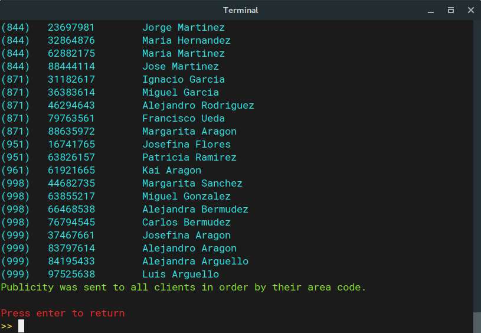

Introduction
============

This program simulates a network manager for a telecommunications company. The hypothetical company offers two kinds of services: regular phone calls and video calls. All the network's clients are under a respective station. Every station has at least one client and a unique area code, links between stations allow clients within them to communicate.The specifications are as follows:

-   This program allows two clients to communicate through a phone call if the stations are linked or if there's a route through a number of stations that allows the original two to connect (More formally, a trajectory or walk that omits edges), and allows clients to use the video service if said route uses less than or equal links as there are links in the whole network.
-   This program also allows the company to send publicity to all the clients in order of:
    1.  Phone number.
    2.  Station's area code, then phone number.
-   Finally, this program allows the company to send publicity to all the clients within a station.

The network structure itself is stored as `resources/network.xml` and is loaded from disk every time the program launches. The subjacent structure is a simple undirected labeled graph[1] [2].

Definitions
-----------

The following definitions were taken from Gordon College's course of [Discrete Mathematics MAT230 (Fall 2016)](http://math.gordon.edu/courses/mat230/handouts/graphs.pdf) and [Wolfram's Mathworld](http://mathworld.wolfram.com/LabeledGraph.html):

1.  A *graph* *G* = (*V*, *E*) consists of a set *V* of vertices (also called nodes) and a set *E* of edges.
2.  If an edge connects to a vertex we say the edge is *incident* to the vertex and say the vertex is an *endpoint* of the edge.
3.  If an edge has only one endpoint then it is called a *loop edge*.
4.  If two or more edges have the same endpoints then they are called *multiple or parallel* edges.
5.  Two vertices that are joined by an edge are called *adjacent* vertices.
6.  A *simple graph* is a graph with no loop edges or multiple edges. Edges in a simple graph may be specified by a set {*v*<sub>*i*</sub>, *v*<sub>*j*</sub>} of the two vertices that the edge makes adjacent.
7.  The *degree* of a vertex is the number of edges incident to the vertex and is denoted deg<sub>*G*</sub>(*v*).
8.  A simple undirected graph in which all the vertices are labeled with a unique natural number is a *labeled graph*.

Theorems
--------

With the previous definitions we extend the following theorems:

1.  A vertex can be connected to at most |*V*|−1 other vertices, else a loop or parallel edge occurs.
    ∀*v* ∈ *V*, 0 ≤ deg<sub>*G*</sub>(*v*)&lt;|*V*|
2.  All simple graphs have an even number of odd degree vertices, this is known as the [*Handshaking Lemma*](https://proofwiki.org/wiki/Handshake_Lemma)
    ∑<sub>*v* ∈ *V*</sub>deg<sub>*G*</sub>(*v*)=2|*E*|
3.  A sequence of non-negative integers *d*<sub>1</sub> ≥ ⋯ ≥ *d*<sub>*n*</sub> can be represented as the degree sequence of a finite simple graph on *n* vertices if and only if *d*<sub>1</sub> + ⋯ + *d*<sub>*n*</sub> is even and
    $$\\sum^{k}\_{i=1}d\_i\\leq k(k-1)+ \\sum^n\_{i=k+1} \\min(d\_i,k)$$
     holds for every *k* in 1 ≤ *k* ≤ *n*. This is known as the [*Erdős–Gallai theorem*](https://en.wikipedia.org/wiki/Erd%C5%91s%E2%80%93Gallai_Theorem).
4.  The *n* vertex graph with the maximum number of edges that is still disconnected is a complete graph (all nodes are connected to the remaining nodes) of *n* − 1 nodes with an additional isolated vertex. Hence, there are $\\binom{n}{2} = \\frac{(n-1)(n-2)}{2}$ edges in such graph and adding any other possible vertex will yield a connected graph of *n* nodes. Ie. The minimum number of edges needed to guarantee connectivity for an *n* vertex graph is:
    $$\\frac{(n-1)(n-2)}{2}+1$$

Implementation
==============

This program has three main components:

-   The command line interface (CLI), that allows the user to call upon this programs operations.
-   The network structure.
-   The network loader.

The structure.
--------------

The most important structure in this program is the Labeled Graph in `fciencias.edatos.network.Network`, it implements the interface in [*Figure 1*](#fig1). It uses a HashTable to store its labeled vertices, Stations (`fciencias.edatos.network.Station` which store their neighbors in a HashSet), as area code - Station pairs.

### Elementary operations

This are the elementary operations specified by the `LabeledGraph` and some of their properties within `Netowork`:

-   `addVertex(int, T)` → `boolean`, is **O**(n), this is because if a replacement takes place, the graph has to rebuild edges using previous neighbors and newly added ones. But if no replacement takes place (unique area codes are respected) it's **O**(1). In other words, addition is **O**(1), replacement is **O**(n).
-   `addEdge(int, int)` → `boolean`, is **O**(1).
-   `addEdge(T, T)` → `boolean`, is **O**(1).
-   `getVertex(int)` → `T`, is **O**(1).
-   `edgesSize()` → `int`, is **O**(n²) because it uses `degreeSum()`.
-   `verticesSize()` → `int`, is **O**(n²) because it exhaustively performs [**BFS**](https://en.wikipedia.org/wiki/Breadth-first_search) on the graph to discover newly added neighbors and adds them to the graph's HashTable when counting them.
-   `degreeSum()` → `int`, is **O**(n²) because it uses `verticesSize()`. This method checks that some theorems hold an raises an exception if it detects anomalies. The theorems that are actively checked are theorems [**1** and **2**](#theorems).
-   `isEmpty()` → `boolean`, is **O**(1).
-   `contains(T)` → `boolean`, is **O**(1).
-   `getLabeledVertices()` → `Map<Integer,T>`, is **O**(n²) because it uses `edgesSize()` to expand the graph before returning a copy of its HashTable.
-   `areAdjacent(int, int)` → `boolean`, is **O**(1).
-   `areAdjacent(T, T)` → `boolean`, is **O**(1).


### Additional operations

In addition to this elementary operations, `Network` also implements the following methods that extend its functionality (*c* is the number of clients within the network):

-   `quickEdgesSize()` → `int`, is **O**(*n*log(*n*)) since it sorts the list of all the network's station's degrees using [*Timsort*](https://en.wikipedia.org/wiki/Timsort).
-   `getAllClientsByPhone()` → `List<Client>`, is **O**(*c*log(*c*)), because it uses [*Timsort*](https://en.wikipedia.org/wiki/Timsort) on all the network's clients.
-   `getAllClientsByStation()` → `List<Client>`, is **O**(*c*log(*c*)), because it uses [*Timsort*](https://en.wikipedia.org/wiki/Timsort) on each station's client set.
-   `linearErdosGallai(List<Integer>)` → `boolean`, is **O**(n) per the theorems in [**this paper**](http://www.cs.elte.hu/egres/tr/egres-11-11.pdf); this basically implements the [Erdos-Gallai theorem](#theorems).
-   `getTrajectory(T, T)` → `List<Station>`, is **O**(n²) because it uses `getTrajectory(int, int)`.
-   `getTrajectory(int, int)` → `List<Station>`, is **O**(n²) because it uses `edgesSize()` to expand the graph before extracting the trajectory.

The parser
----------

In order to properly load the provided `network.xml` into the structure, the `NetworkLoader` class uses [DOM](https://docs.oracle.com/javase/7/docs/api/org/w3c/dom/package-summary.html) and a [dtd](https://en.wikipedia.org/wiki/Document_type_definition) file (`resources/Network.dtd`). The XML file representing the `Network` looks like this:

``` xml
<?xml version="1.0" encoding="UTF-8"?>
<!DOCTYPE Network SYSTEM "Network.dtd">
<Network links="277" stations="25">
    <Station code="55" name="Mexico City">
        <Client name="Daniel Bermudez" phone="71416892"/>
        <Client name="Jose Arguello" phone="12297883"/>
    </Station>
    <Station code="81" name="Monterrey, Nuevo Leon">
        ...
    </Station>
    ...
    <Link stationACode="33" stationBCode="686"/>
    <Link stationACode="686" stationBCode="229"/>
    <Link stationACode="998" stationBCode="744"/>
    ...
</Network>
```

where each *Station* tag represents a chemical element with corresponding `name` (self-explanatory), and `code` (unique area code), and each *Link* tag represents a link between the stations with codes `stationACode` and `stationACode`. Also, every *Station* tag has a number of *Client* tags which represent the station's clients and each have attributes `name` and `phone` (both, self-explanatory).

### Random network generation script

In order to create a random xml that adheres to the aforementioned Network.dtd, the following python script was created (source code in `resources/stations.py`):

``` python
from xml.etree.ElementTree import ElementTree as Tree
from xml.etree.ElementTree import Element as Elem
from random import randint
import xml.etree.ElementTree as e_tree
import os


F_NAMES = """Luis
...
Elizabeth""".splitlines()

L_NAMES = """Rodriguez
...
Arguello""".splitlines()

STATIONS = """55-Mexico City
...
951-Oaxaca, Oaxaca""".splitlines()

def main():
    root = Elem('Network')
    area_codes = []
    for station in STATIONS:
        words = station.split('-')
        area_code = words[0]
        area_codes.append(area_code)

        name = words[1]
        new_station = Elem('Station')
        new_station.set('code', str(area_code))
        new_station.set('name', name)
        appendclients(new_station, randint(1, 5))
        root.append(new_station)

    min_conn = ((len(area_codes) - 1)*(len(area_codes) - 2))//2 + 1
    links = set()
    for _ in range(min_conn):
        station_a, station_b = getlink(links, area_codes)
        new_link = Elem('Link')
        new_link.set('stationACode', station_a)
        new_link.set('stationBCode', station_b)
        root.append(new_link)

    root.set('links', str(min_conn))
    root.set('stations', str(len(area_codes)))
    with open('network.xml', 'wb') as f:
        f.write(b'<?xml version="1.0" encoding="UTF-8" ?><!DOCTYPE Network SYSTEM "Network.dtd">')
        Tree(root).write(f, 'utf-8')
...
```

This line in particular needs some explaining, it is calculating the minimum links necessary to guarantee that the graph will be connected per [theorem 4](#theorems):

``` python
min_conn = ((len(area_codes) - 1)*(len(area_codes) - 2))//2 + 1
```

While `F_NAMES` and `L_NAMES` hold random first names and last names respectively, `STATIONS` were taken from [**this page**](https://en.wikipedia.org/wiki/Telephone_numbers_in_Mexico) and represent real life cities with their respective area codes.

Using the program
=================

The program explains the options available to the user when it's first launched. It uses [regular expressions](https://en.wikipedia.org/wiki/Regular_expression) for all its user input validation, hence it's pretty robust, it won't accept invalid options or incorrect syntax.


Making a call
-------------

In order for a call to be successful, first of all the specified phone numbers must exist within their corresponding area codes. If both clients are accounted for by their respective stations, a route is then calculated. If the resulting route is shorter (in terms of links traversed) than or equal to the number of links within the whole network, the program asks the client if they wish to use video. Using standard yes or no answers, the call is placed with the appropriate conditions.


Sending publicity to all clients
--------------------------------

In order to send publicity to all clients in the network, two options are available. The Company can send the publicity in order by the clients' phone numbers, or in order by area code, and then by phone number.




Sending publicity to clients in a specific area code
----------------------------------------------------

Lastly, the Company can also send targeted publicity to all the clients within an area code.


Building and running the program
================================

The program can be built using ant, the available commands are described in the next section [ANT](#ant). If you're on Linux and have [python](https://www.python.org/downloads/) installed, then running the following command from the project's main directory will be enough to build and run the program: `ant executable; ./network`. After having run `ant executable` once, you'll only need to run `./network` to launch the program, though.

ANT commands
------------

The included `build.xml` provides the following commands:

1.  `ant compile`, compiles the program to `build/classes/`.
2.  `ant doc`, generates the program's documentation and puts it inside `doc/`.
3.  `ant jar`, compiles the program and creates a jar, `build/jar/Network.jar`.
4.  `ant run`, compiles the program, creates the jar and runs the application (using the awful ant logger). This is not the recommended way to run the program, use the following command to create an executable instead:
5.  `ant executable`, creates a runnable file `./network` that uses a [python](https://www.python.org/downloads/) script to run the actual jar file.
6.  `ant all`, generates documentation, compiles the program, creates the jar file and the runnable file.
7.  `ant clean`, deletes all files and folders except for `src/`, `resources/`, `build.xml` and `README.pdf`.

Acknowledgements
================

For more information on the tools used to build, create and run this program see:

-   [Apache Ant](http://ant.apache.org/).
-   [Document object model](https://docs.oracle.com/javase/7/docs/api/org/w3c/dom/package-summary.html).
-   [Document type definition](https://en.wikipedia.org/wiki/Document_type_definition).
-   [Python](https://www.python.org/).
-   [Regular expressions](https://en.wikipedia.org/wiki/Regular_expression).

[1] http://mathworld.wolfram.com/LabeledGraph.html

[2] https://en.wikipedia.org/wiki/Graph\_labeling
